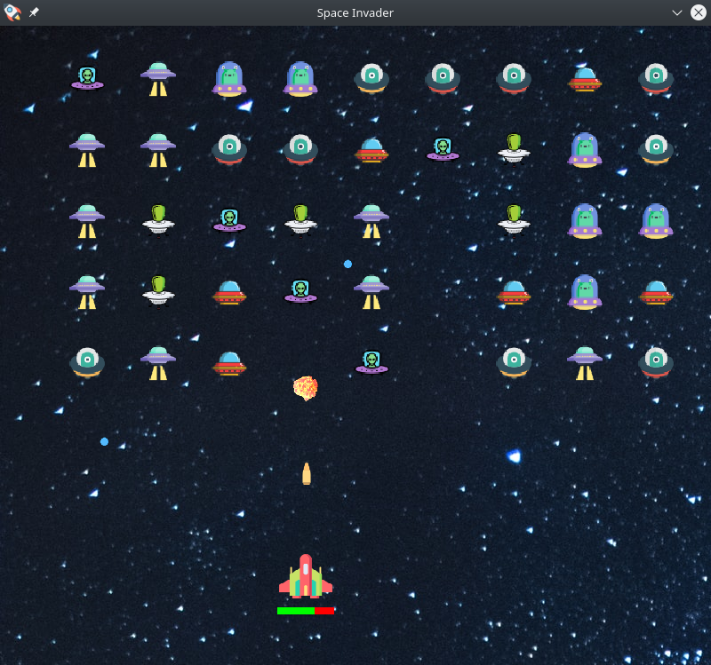

This is pygame implementation of classic 'Space Invader' game.

It has no other dependency beside "pygame"

clone this repo and execute 'main.py' file

<strong>How To Play:</strong>
<ul>
    Your spaceship(player) has 3 hit-point after which your spaceship will be destroyed. 
    Alien(enemy) shoots bombs at you randomly, try to dodge the bombs while shooting bullet to destroy enemy.
</ul>

<strong>Controls:</strong>
<ol>
<li>press left/right arrow key to move spaceship in left/right direction.</li>
<li>Press spacebar to shoot bullets.</li>
<li>After game over to replay the game press R key.</li>
</ol>

<strong>Preview:</strong> 
